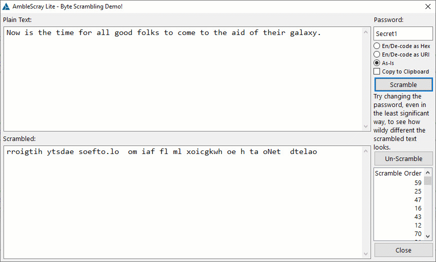

# AmbleScrayLite
## Scramble data by way of a password.

Version a.01.

AmbleScray Lite is basically a simple way to re-arrange data in a reliably repeatable way. All it needs to know is two things: 
- How many items need to be scrambled (in this case, how many characters)
- A password  

Basics of how this algorithm works:
- The password is processed in a loop, concatenating it with the value of the current iteration. 
- A checksum function then processes this concatenation, and the result is saved to a queue.
- When all of the checksums have been performed, the queue is sorted by the results.
- The result of this checksum (CRC32 in this case) is so "wildly" different for each iteration, that the sort order is almost always very very scrambled.

"Scrambled", in the case of this code, means that all of the same character values are still in the string, but they're just really really mixed up. 

Try playing with different passwords, and notice how the URI encoding changes the result.

## CAVEAT: Although I've never seen it happen, there could be occurrences where the "scrambled" text could resemble or even be identical to the plaintext. 

## Clarion

In this release, there is a Clarion demo & class in the Clarion folder. This is still a work in progress, but it works.

### Acknowledgements

The CRC32 function used in this example was written by Geoff Robinson. https://clarionhub.com/t/crc32-document/4485/9. This function is used instead of the built-in Clarion CRC32 for compatibility with other languages.

## Other Languages

My intent is to create libraries (either by myself, or by other developers) for other languages, such as C#, python, etc and place them here.

### JavaScript

There is a proof of concept (POC) example of how this could be written in JavaScript (in the JavaScript_POC folder), but it is just a basic example. It needs a bit of work to use as a library, but its results are compatible with the Clarion example. 
